# R2RPC

[](https://wakatime.com/badge/user/bd5036d3-6da5-4386-8a6b-2acdaf448df5/project/4d0173df-ceea-4da6-b039-6f406b360801)
[](https://github.com/rezoch340/R2RPC/actions/workflows/publish-ghcr.yml)


> [!IMPORTANT]
> **R2RPC 是 [manyuegong33/r0rpc](https://github.com/manyuegong33/r0rpc) 的分布式重构版本。**
> 本项目在原有设备 RPC 中继目标上，重新设计了分布式运行架构、数据边界、权限体系、
> 可观测性、管理控制台和容器化部署能力。

**R2RPC 是面向在线设备的实时 RPC 中继与运维控制平台。**

调用方通过 HTTP 提交任务，服务端将请求实时派发给符合功能组和身份边界的 WebSocket
设备，并把执行结果同步返回给调用方。平台同时提供完整的后台控制台、权限组、令牌管理、
手动 RPC 调试、请求观测、设备 AppAudit Step 和系统操作审计。

[快速开始](#快速开始) · [系统架构](#系统架构) · [统一配置](#统一配置) ·
[验证与测试](#验证与测试) · [项目文档](#项目文档) ·
[GitHub 仓库](https://github.com/rezoch340/R2RPC)

---

## 为什么使用 R2RPC

R2RPC 解决“服务端需要调用位于 NAT、移动网络或客户现场中的在线设备”这一类问题：

- **实时派发**：通过持久 WebSocket 连接把 HTTP RPC 请求转发到指定设备或由服务端自动路由。
- **官方 SDK**：Android/Kotlin 与 JavaScript/TypeScript 同时覆盖设备接入、调用方请求和
  AppAudit Recorder。
- **明确隔离**：Access Token、Device Token、功能组和 `clientId` 共同约束调用边界。
- **完整观测**：请求状态、耗时、载荷、设备 AppAudit Step、趋势指标和系统操作日志可追溯。
- **独立控制面**：管理前端覆盖功能组、设备、令牌、账号、权限组、日志和手动调试。
- **冷热路径分离**：API 负责 RPC 热路径，Worker 异步处理索引、聚合与维护任务。
- **可重复部署**：统一 `config.yaml` 契约和完整 Docker Compose 编排覆盖全部运行组件。
- **受限性能验收**：Docker 内置公开 API 混合压测，并把完整 Compose 硬限制在 4 核、4 GiB 内。

## 核心能力

| 领域 | 能力 |
|---|---|
| RPC 中继 | HTTP → WebSocket 实时派发、自动路由、指定设备、超时、错误和无设备状态 |
| 设备连接 | Device Token 鉴权、心跳、在线状态、最大并发、断线清理和多实例事件同步 |
| 租户边界 | 功能组作用域、Access Token / Device Token 隔离、`clientId` 边界硬化 |
| 后台权限 | JWT、19 条内置权限、权限组并集授权、root 管理员写隔离 |
| 手动调试 | 选择功能组、历史 Action、在线设备、超时和 JSON Payload，走真实 RPC 链路 |
| 请求观测 | 请求筛选分页、状态与延迟、Manticore 载荷索引、近 7 天趋势 |
| 设备审计 | 设备随 WS `result` 上报 AppAudit V1 Step，请求、响应和错误分段展示 |
| 系统审计 | 登录、控制面读取、Guard 拒绝和业务写操作审计，不记录密码或 Token 明文 |
| 管理控制台 | Next.js + shadcn 响应式后台，全部实体表支持筛选与分页 |
| 官方 SDK | Android/Kotlin、JavaScript/TypeScript 设备端与调用方 SDK，内置重连、超时和 AppAudit Recorder |
| 部署运维 | 统一 YAML、独立迁移/种子、健康检查、非 root 应用容器、持久化卷 |
| 公网入口 | loopback 容器端口、Nginx/OpenResty 双域名反代、Cloudflare Full (strict) 与 WSS |
| 性能验收 | 4 台虚拟在线设备、真实 WS Hello、自动轮询/随机指定设备、质量阈值和 JSON 报告 |
| 本地质量门禁 | 一条命令覆盖后端/前端 lint、格式、构建、单测和契约漂移，可选完整黑盒 |
| 镜像发布 | `v*` 标签自动发布 backend/frontend 的版本标签与 `latest` 到 GHCR |

## 管理面板样例

### 运行概览

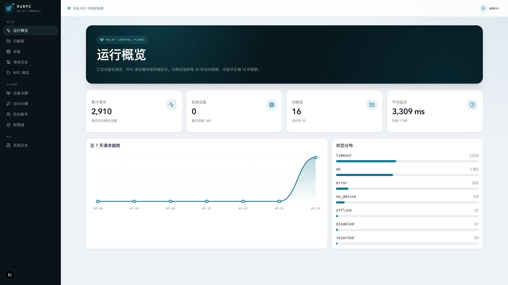

> 运行概览集中展示累计请求、在线设备、功能组、平均延迟、近 7 天请求趋势和状态分布；
> 指标来自真实后端接口，不使用前端静态演示数据。

### 功能与设备

<table>
  <tr>
    <th width="50%">功能组</th>
    <th width="50%">设备</th>
  </tr>
  <tr>
    <td>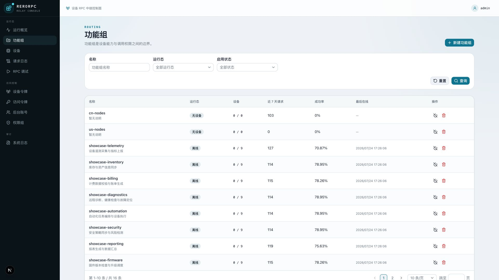</td>
    <td>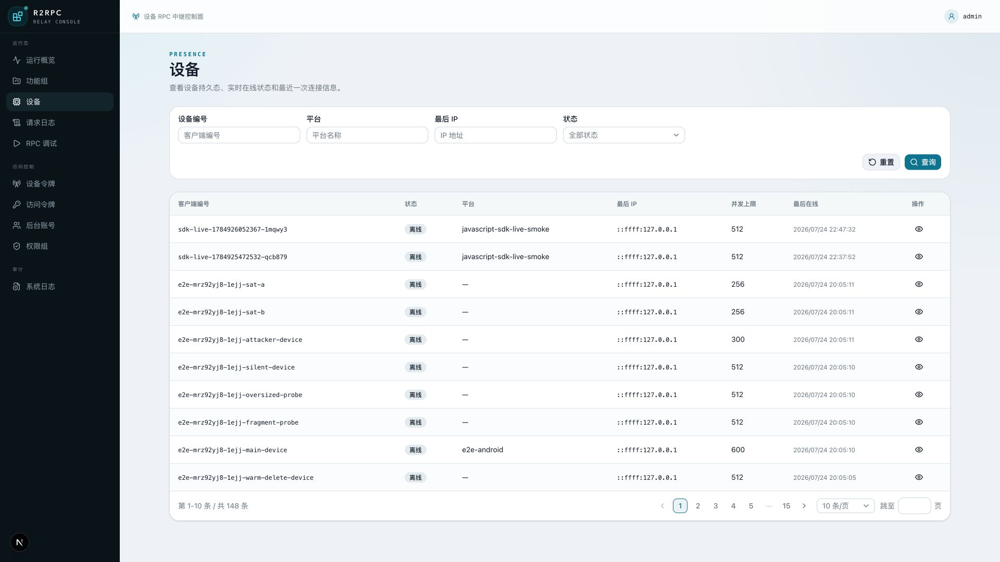</td>
  </tr>
</table>

### 请求观测与手动调试

<table>
  <tr>
    <th width="50%">请求日志</th>
    <th width="50%">请求详情抽屉</th>
  </tr>
  <tr>
    <td>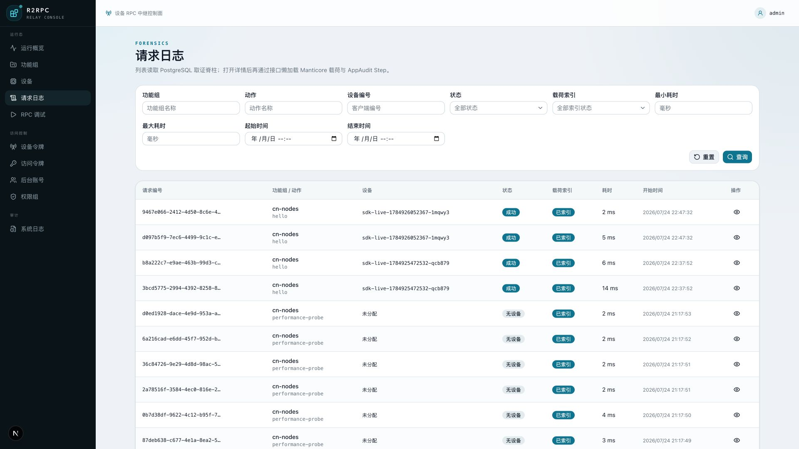</td>
    <td>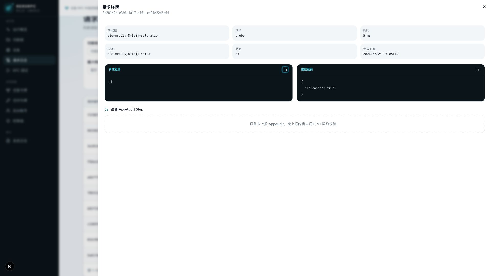</td>
  </tr>
  <tr>
    <th colspan="2">手动 RPC 调试</th>
  </tr>
  <tr>
    <td colspan="2">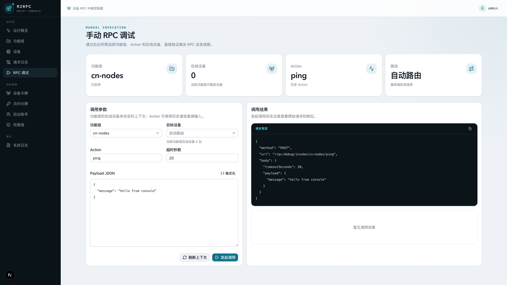</td>
  </tr>
</table>

### 登录与访问控制

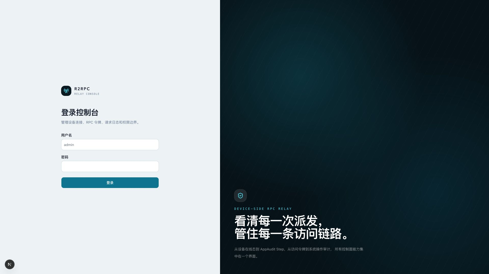

<table>
  <tr>
    <th width="50%">Device Token</th>
    <th width="50%">Access Token</th>
  </tr>
  <tr>
    <td>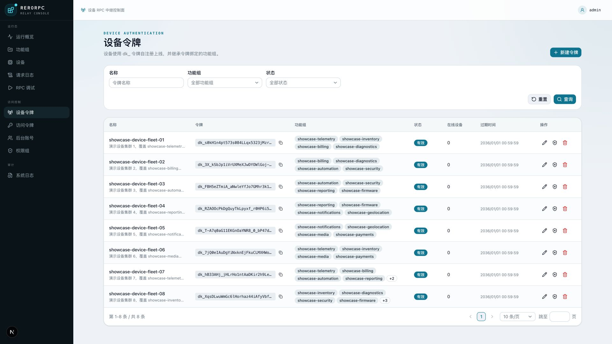</td>
    <td>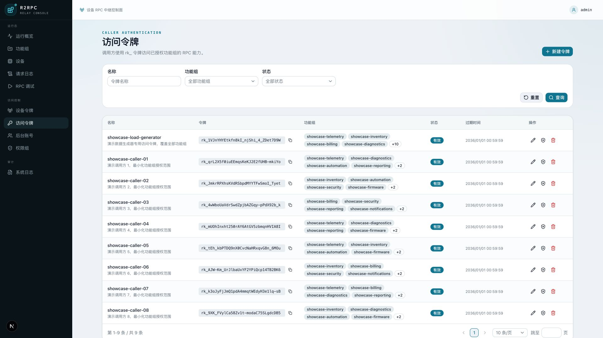</td>
  </tr>
  <tr>
    <th>后台账号</th>
    <th>权限组与权限目录</th>
  </tr>
  <tr>
    <td>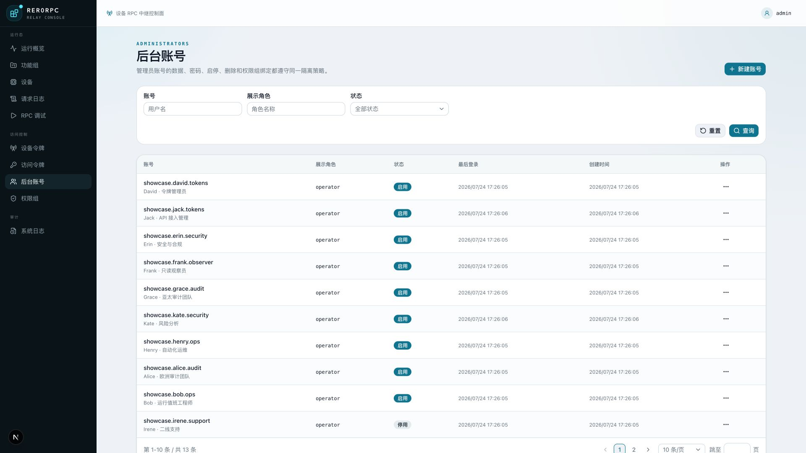</td>
    <td>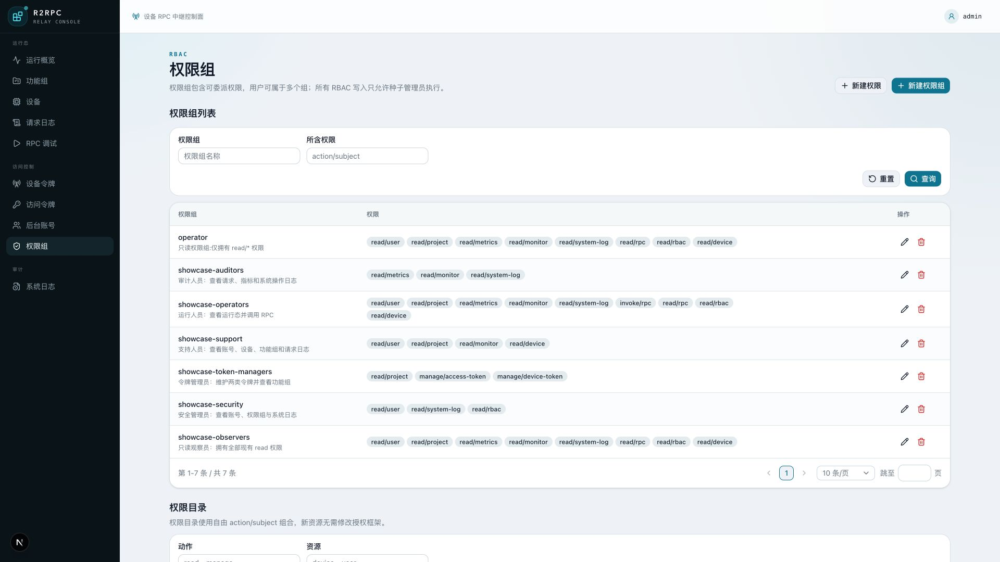</td>
  </tr>
</table>

### 系统操作审计

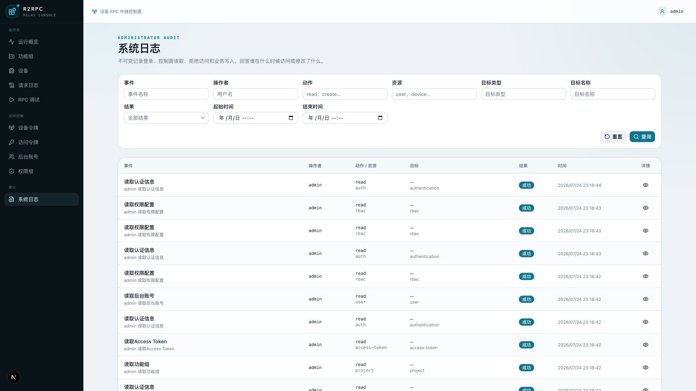

## 系统架构

R2RPC 将实时 RPC 热路径、异步日志冷路径和管理控制面分离。Redis 保存跨实例协调状态，
PostgreSQL 保存权威业务数据，Manticore 专门承载大载荷和设备执行 Step。

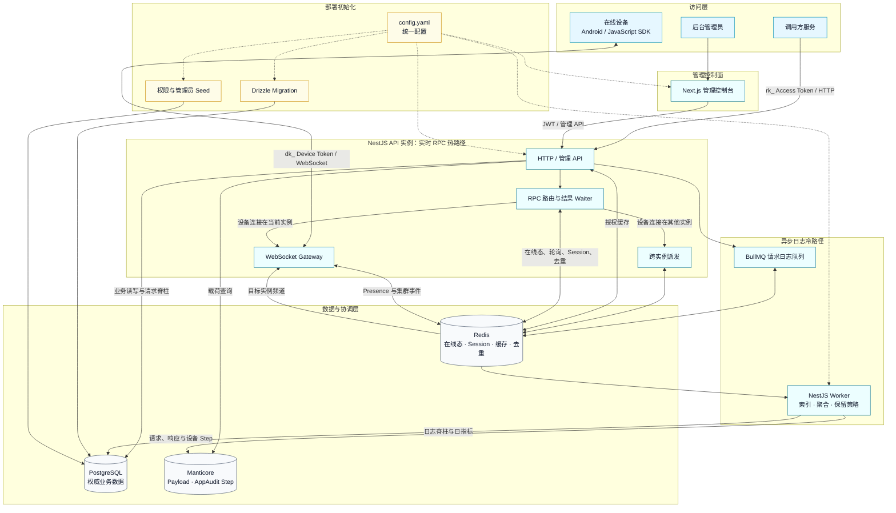

> API 实例通过 Redis session、waiter、Pub/Sub、结果去重和轮询游标协同；请求命中其他实例
> 上的设备连接时，由 Redis Pub/Sub 完成跨实例派发。前端始终只调用公开 HTTP API，不直连
> PostgreSQL、Redis 或 Manticore。

### RPC 主链路

1. 调用方使用 Access Token 请求 `POST /rpc/invoke/:project/:action`。
2. API 校验 Token、功能组、可选 `clientId` 边界和可选次数上限；有次数上限时通过
   PostgreSQL 原子占用一次调用额度。
3. 服务端在目标功能组内选择在线设备，通过 WebSocket 派发任务。
4. 设备回传结果以及可选的 AppAudit V1 Step。
5. API 将结果返回调用方；Worker 异步完成载荷索引、指标聚合和维护任务。

### 进程职责

| 进程 | 职责 |
|---|---|
| API | HTTP、可配置 Swagger、设备 WebSocket、鉴权、路由和 RPC 热路径 |
| Worker | BullMQ 日志消费、Manticore 索引、日指标、保留策略和定时维护 |
| Frontend | 后台控制面与运行观测，不直接访问 PostgreSQL、Redis 或 Manticore |
| Migration | 独立、幂等的 Drizzle 数据库迁移任务 |
| Seed | 独立、幂等的管理员、权限目录和演示数据初始化任务 |

## 技术栈

| 层级 | 技术 |
|---|---|
| 后端 | Node.js 24、TypeScript、NestJS 11、Drizzle ORM |
| 前端 | Next.js 16、React 19、Tailwind CSS 4、shadcn、TanStack Query |
| 实时通信 | WebSocket |
| 客户端 SDK | Kotlin、Coroutines、OkHttp；TypeScript、Fetch、isomorphic-ws |
| 数据库 | PostgreSQL 16 |
| 缓存与队列 | Redis 7、BullMQ |
| 搜索与载荷索引 | Manticore Search |
| 权限 | JWT、CASL、权限组 RBAC |
| 验证 | Jest、HTTP/WebSocket 黑盒冒烟、Playwright |
| 部署 | Docker、Docker Compose、统一 YAML 配置 |

## 快速开始

### 方式一：Docker Compose 完整启动

适合首次体验和完整环境验收，只需要 Docker 与 Docker Compose：

```bash
cp deploy/config.example.yaml deploy/config.yaml
docker compose up -d --build
docker compose ps
```

Compose 会按以下顺序启动：

```text
PostgreSQL healthy → migration completed → seed completed → API / Worker
Redis healthy ───────────────────────────────────────────→ API / Worker
Manticore healthy ───────────────────────────────────────→ API / Worker
API healthy ─────────────────────────────────────────────→ Frontend
```

默认入口：

| 服务 | 地址 |
|---|---|
| 管理控制台 | `http://127.0.0.1:3001` |
| HTTP API | `http://127.0.0.1:3000` |
| Swagger | `http://127.0.0.1:3000/docs`（`app.openApiEnabled: true` 时） |
| 默认管理员 | `admin / admin123456` |

查看启动日志：

```bash
docker compose logs -f api worker frontend
docker compose logs migration seed
```

在同一套容器中执行性能测试：

```bash
docker compose --profile performance run --rm performance
cat performance-results/latest.json
```

性能服务会挂载 4 台虚拟在线设备，通过公开 HTTP/WebSocket 完成手动自动路由、
Access Token 自动轮询和随机指定设备 `hello`；不会直连 PostgreSQL、Redis 或 Manticore。
Compose 对全部服务声明的 CPU 上限合计 **4.00 核**，内存上限合计 **3840 MiB**，低于
**4 GiB** 硬预算。

### 方式二：本地开发

需要 Node.js 24、pnpm 11 和 Docker Compose。

```bash
corepack enable
cp config.example.yaml config.yaml

(cd backend && pnpm install)
(cd frontend && pnpm install)

# 启动 PostgreSQL、Redis、Manticore，并执行迁移与种子
sh deploy/dev-up.sh
```

分别启动三个开发进程：

```bash
# Terminal 1
cd backend
pnpm dev:api

# Terminal 2
cd backend
pnpm dev:worker

# Terminal 3
cd frontend
pnpm dev
```

## 统一配置

API、Worker、迁移、种子和管理前端使用同一份 YAML 契约：

- 宿主机模板：[`config.example.yaml`](config.example.yaml)
- Compose 模板：[`deploy/config.example.yaml`](deploy/config.example.yaml)

```yaml
app:
  port: 3000
  publicWsUrl: ws://127.0.0.1:3000/api/client/ws
  corsOrigins:
    - '*'

frontend:
  apiUrl: null
  apiPort: 3000
  allowedDevOrigins: []

db:
  host: 127.0.0.1
  port: 5432

redis:
  host: 127.0.0.1
  port: 6379

performance:
  baseUrl: http://127.0.0.1:3000
  projectName: cn-nodes
  virtualDeviceCount: 4
  durationSeconds: 20
  concurrency: 16
  targetRequestsPerSecond: 80
  maximumErrorRate: 0.01
  maximum95thPercentileLatencyMilliseconds: 750
  minimumThroughputRequestsPerSecond: 60
```

完整配置还包括 JWT、授权缓存 TTL、Manticore、种子管理员、性能阈值和日志保留策略。真实
`config.yaml` 已被 Git 忽略；仓库只提交不包含生产秘密的 example。

只保留 `CONFIG_FILE` 作为可选的配置文件位置选择器，业务配置值不再分散到前后端 `.env`
或独立 YAML。前端只向浏览器注入 `frontend.apiUrl` 和 `frontend.apiPort`，不会暴露数据库、
Redis、JWT 或管理员配置。

详细字段和部署边界见[部署文档](deploy/README.md)。

## 鉴权模型

| 身份 | 凭证 | 用途 |
|---|---|---|
| 调用方 | Access Token | 调用已授权功能组的公开 RPC |
| 设备 | Device Token | 建立 WebSocket 并继承已绑定功能组 |
| 后台用户 | JWT | 登录管理控制台并按权限组访问控制面 |

- Access Token 与 Device Token 都支持二次编辑功能组，更新后相关缓存立即失效。
- Device Token 是设备长期凭证，不设置过期时间；只通过撤销或删除使其失效。Access Token
  可同时按绝对时间或 RPC 调用次数过期，并可二次编辑两类策略；编辑不会清零累计调用次数。
- Device Token 作用域变化后，旧作用域连接会主动断开，设备重连后继承新配置。
- `isRoot=true` 的种子管理员只能由本人修改；RBAC 写操作仅 root 可执行。
- 用户和权限快照使用公共 Redis cache-aside，未命中时回源 PostgreSQL 并回写。

## API 与管理控制台

当前 OpenAPI 包含 **39 个 HTTP 路径模板**，完整契约见：

- 在线 Swagger：`http://127.0.0.1:3000/docs`（可通过 `app.openApiEnabled: false` 关闭）
- 仓库定义：[`docs/openapi.yaml`](docs/openapi.yaml)

主要入口：

| 接口 | 说明 |
|---|---|
| `POST /rpc/invoke/:project/:action` | 调用方发起 RPC |
| `GET /rpc/clientQueue?project=...` | 查看 Access Token 边界内的在线设备 |
| `PATCH /access-tokens/:id` | 编辑 Access Token 功能组、时间与次数上限 |
| `GET /rpc/debug/options` | 获取后台手动调试上下文 |
| `POST /rpc/debug/invoke/:project/:action` | 后台 JWT 手动发起真实 RPC |
| `GET /monitor/requests` | 请求日志筛选分页 |
| `GET /metrics/overview` | 运行概览指标 |
| `GET /system-logs` | 系统操作审计 |
| `GET /api/client/ws` | 设备 WebSocket 入口 |

管理前端覆盖：

- 运行概览与近 7 天请求趋势
- 功能组、设备、Access Token、Device Token
- 请求日志、载荷详情与 AppAudit Step
- 手动 RPC 调试
- 后台账号、权限组与权限目录
- 系统操作审计

全部表格默认 **10 条/页**、最大 **100 条/页**，支持适合该实体的字段筛选。

## 验证与测试

当前验证基线：

| 验证层 | 基线 |
|---|---:|
| HTTP/WebSocket 黑盒冒烟 | 180 passed |
| 后端 Jest | 10 suites / 35 tests |
| 前端 Playwright | 12 passed |
| JavaScript SDK | 3 files / 10 tests |
| Android SDK | 3 classes / 8 tests |
| OpenAPI | 39 paths |
| 受限 Compose 性能测试 | 4 devices / 1600 requests / 0 failures / 80.03 req/s / P95 7.50 ms |

> 该测试结果仅代表 R2RPC 后台服务性能，不代表真实设备端侧的执行性能。

```bash
# 日常提交前：后端与前端静态质量门禁
./scripts/local-ci.sh

# 发布前：额外启动隔离 Compose，执行 HTTP/WS 与浏览器黑盒
./scripts/local-ci.sh --full

# JavaScript / TypeScript SDK
cd sdk/javascript
corepack pnpm check

# Android / Kotlin SDK
cd ../android
./gradlew :r2rpc-sdk:testDebugUnitTest :r2rpc-sdk:assembleRelease

# 性能测试
cd ../..
docker compose --profile performance run --rm performance
```

`local-ci.sh --full` 只通过公开 HTTP、WebSocket 和浏览器 UI 验证系统，不直接
连接数据库、Redis 或 Manticore；性能执行器遵守同一黑盒边界，并校验所有虚拟设备都实际
收到 Hello。源码门禁同时禁止含糊缩写变量名，并限制控制流复杂度。Pull Request 与
`main` 推送不会启动 GitHub Actions；检查结果由提交者在本地确认。

## 项目结构

```text
R2RPC/
├── backend/                 NestJS API、Worker、迁移、种子和黑盒测试
├── frontend/                Next.js 管理控制台与 Playwright E2E
├── deploy/                  Compose 配置模板、启动脚本和部署说明
├── docs/                    OpenAPI、当前文档、设计规格与历史归档
├── scripts/local-ci.sh      后端/前端本地质量门禁与可选完整黑盒
├── sdk/                     Android/Kotlin 与 JavaScript/TypeScript SDK
├── compose.yaml             完整容器编排
├── config.example.yaml      宿主机统一配置模板
├── CHANGELOG.md             变更记录
├── CONTRIBUTING.md          贡献流程与质量门禁
├── SECURITY.md              安全报告和生产安全基线
├── LICENSE / NOTICE         当前许可状态与上游归属说明
└── README.md
```

## 项目状态

- 后端功能 backlog #1–#15 已完成。
- 设备 RPC、后台控制面、权限、审计、管理前端、完整 Compose 和容器性能验收已形成闭环。
- Android/Kotlin 与 JavaScript/TypeScript SDK 已纳入仓库，设备与调用方可直接复用
  [SDK 接入说明](sdk/README.md)。
- 后端与前端质量门禁、完整 Compose 黑盒均由 `scripts/local-ci.sh` 在本地执行；GitHub
  Actions 只在推送 `v*` 标签时发布 `r2rpc-backend` 和 `r2rpc-frontend` GHCR 镜像。
  SDK 不进入该自动构建。
- 发布阶段待办以[`docs/下一步-后端待办.md`](docs/下一步-后端待办.md)为准。

## 项目文档

### 当前真源

- [项目总览](docs/项目总览-中文.md)
- [文档索引与有效性说明](docs/README.md)
- [核心能力矩阵](docs/R2RPC-核心功能统计.md)
- [后端进度台账](docs/后端进度.md)
- [后端开发说明](backend/README.md)
- [前端开发说明](frontend/README.md)
- [Android 与 JavaScript SDK](sdk/README.md)
- [部署与 Docker Compose](deploy/README.md)
- [工程规范](docs/design-conventions.md)
- [OpenAPI](docs/openapi.yaml)
- [Changelog](CHANGELOG.md)
- [贡献指南](CONTRIBUTING.md)
- [安全策略](SECURITY.md)
- [发布流程](docs/releasing.md)
- [行为准则](CODE_OF_CONDUCT.md)
- [许可与归属](LICENSE)

### 协议与设计

- [设备 AppAudit V1 接入协议](docs/device-app-audit.md)
- [Android 与 JavaScript SDK 设计](docs/superpowers/specs/2026-07-24-device-sdks-design.md)
- [管理员账号隔离与改密设计](docs/superpowers/specs/2026-07-24-administrator-account-isolation-design.md)
- [权限组设计](docs/superpowers/specs/2026-07-24-permission-groups-design.md)
- [系统操作审计日志设计](docs/superpowers/specs/2026-07-24-system-audit-logs-design.md)
- [管理前端设计](docs/superpowers/specs/2026-07-24-management-frontend-design.md)
- [手动 RPC 调试设计](docs/superpowers/specs/2026-07-24-manual-rpc-debugger-design.md)
- [统一配置与 Docker Compose 设计](docs/superpowers/specs/2026-07-24-unified-configuration-compose-design.md)
- [容器性能测试与资源预算设计](docs/superpowers/specs/2026-07-24-container-performance-suite-design.md)

## 生产部署提示

推荐链路为 **容器 → 宿主机 Nginx/OpenResty → Cloudflare**，控制台和 API/WSS 使用独立
域名。Compose 的全部宿主机端口只绑定 `127.0.0.1`；生产模板、反向代理配置、Cloudflare
真实来源 IP 更新脚本和端到端入口检查位于
[`deploy/`](deploy/README.md#nginx--openresty--cloudflare-生产入口)。

部署前应从 `deploy/config.production.example.yaml` 生成 `deploy/config.yaml`，关闭运行时
OpenAPI、设置信任 1 跳反向代理、替换 JWT 和管理员初始密码、收紧 CORS，并按真实入口修改
`app.publicWsUrl` 与 `frontend.apiUrl`。Cloudflare 使用 Full (strict)、启用 WebSockets、
绕过 API 缓存，源站 80/443 只允许 Cloudflare 官方 IP 段。

## 许可与发布

当前仓库和 SDK 均为 **UNLICENSED / All Rights Reserved**。公开可见不等于获得复制、修改或
分发许可；详细边界和上游归属见[`LICENSE`](LICENSE)与[`NOTICE`](NOTICE)。在权利人明确批准
前，不得向公共 npm、Maven Central 或其他公开 Registry 发布制品。内部或正式发布步骤见
[`docs/releasing.md`](docs/releasing.md)。

完整说明见[`deploy/README.md`](deploy/README.md)。
