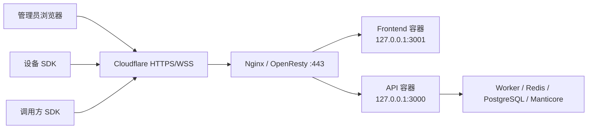

# R2RPC 部署与 Docker Compose

## 统一配置

API、Worker、迁移、种子和前端共用同一份 YAML schema，不再分别维护后端配置、前端 YAML
和 `.env`。

宿主机开发：

```bash
cp config.example.yaml config.yaml
```

完整 Compose：

```bash
cp deploy/config.example.yaml deploy/config.yaml
```

开发用的两份 example 字段完全相同；宿主机模板使用 `127.0.0.1`，Compose 模板使用
`postgres`、`redis`、`manticore` 服务名。`config.production.example.yaml` 是
Nginx/OpenResty + Cloudflare 双域名生产样例。Compose 项目名固定为 `r2rpc`，确保容器网络
与命名卷不受本地仓库目录名影响。真实 `config.yaml` 已被 Git 忽略。

使用 1Panel 管理宿主机 OpenResty 时，不要直接套用系统 Nginx 文件；完整的站点表单、
Release 镜像、证书、WebSocket、Cloudflare 真实 IP、计划任务和验收步骤见
[`deploy/1panel/README.md`](1panel/README.md)。
已有 1Panel 生产环境更新标签时使用
[`deploy/1panel/UPDATE.md`](1panel/UPDATE.md)，其中包含备份、更新、验收、回滚和脱敏实机记录。

配置段：

- `app`：API 端口、全局前缀、公开 WebSocket 地址、CORS Origin、运行时 OpenAPI 开关和
  可信反向代理跳数。
- `frontend`：浏览器 API 地址/端口、开发资源允许来源。
- `db`、`redis`、`manticore`：基础设施连接。
- `jwt`：签名、有效期、授权缓存 TTL。
- `bootstrap.admin`：幂等种子管理员。
- `performance`：目标 API、功能组、虚拟设备数、压测时长/并发/速率、质量阈值和报告路径。
- `retention`：原始日志和聚合保留策略。

只保留可选 `CONFIG_FILE` 作为配置文件位置选择器；应用配置值不得再从环境变量读取。

## 完整 Compose 拓扑

根目录 `compose.yaml` 包含：

| 服务 | 镜像/构建 | 端口 | 角色 |
|---|---|---|---|
| `postgres` | postgres:16-alpine | 127.0.0.1:5432 | 权威业务库和请求日志脊柱 |
| `redis` | redis:7-alpine | 127.0.0.1:6379 | 在线状态、缓存、BullMQ、分布式协调 |
| `manticore` | manticoresearch/manticore | 127.0.0.1:9308/9306 | payload、AppAudit 与全文索引 |
| `migration` | `backend/Dockerfile` | — | 一次性幂等 Drizzle 迁移 |
| `seed` | `backend/Dockerfile` | — | 一次性幂等管理员、权限和演示数据种子 |
| `api` | `backend/Dockerfile` | 127.0.0.1:3000 | HTTP、可选 Swagger、WebSocket、RPC 热路径 |
| `worker` | `backend/Dockerfile` | — | BullMQ 冷路径和定时维护 |
| `frontend` | `frontend/Dockerfile` | 127.0.0.1:3001 | Next.js 管理控制台 |
| `performance` | `backend/Dockerfile` | — | `performance` profile 下的一次性公开 API 混合压测 |

启动顺序由健康检查和完成条件保证：

```text
PostgreSQL healthy → migration completed → seed completed → API / Worker
Redis healthy ───────────────────────────────────────────→ API / Worker
Manticore healthy ───────────────────────────────────────→ API / Worker
API TCP healthy ─────────────────────────────────────────→ Frontend
API healthy + Worker started ─────────────────────────────→ Performance
```

应用容器以非 root 用户运行，统一配置只读挂载，持久数据进入 `r2rpc` project 的命名卷；
不固定 `container_name`。全部宿主机端口只绑定 `127.0.0.1`，公网入口必须经过宿主机反向
代理，PostgreSQL、Redis 和 Manticore 不直接暴露到外网。

## 4 核 4 GiB 硬预算

`compose.yaml` 对每个服务同时声明 `cpus`、`mem_limit` 和 `pids_limit`。即使按最保守口径把
常驻服务、一次性 migration/seed 和可选 performance 服务全部相加，CPU 上限也恰好为
**4.00 核**，内存上限为 **3840 MiB**，不会超过 **4 GiB**。

| 服务 | CPU 上限 | 内存上限 | PID 上限 |
|---|---:|---:|---:|
| `postgres` | 0.65 | 640 MiB | 128 |
| `redis` | 0.25 | 256 MiB | 64 |
| `manticore` | 0.65 | 640 MiB | 128 |
| `migration` | 0.15 | 192 MiB | 64 |
| `seed` | 0.15 | 192 MiB | 64 |
| `api` | 0.85 | 704 MiB | 256 |
| `worker` | 0.40 | 384 MiB | 192 |
| `frontend` | 0.30 | 320 MiB | 128 |
| `performance` | 0.60 | 512 MiB | 128 |
| **声明上限合计** | **4.00** | **3840 MiB** | — |

该预算约束 Compose 创建的运行容器；Docker BuildKit、Docker daemon 与宿主机本身不属于
Compose 服务资源统计。migration、seed 和 performance 是一次性容器，正常运行时不会长期
同时占用预算，但仍已计入上述最坏情况合计。

1Panel 生产部署可按宿主机容量选择另一种模式：
`deploy/1panel/generate-unlimited-compose-file.sh` 会在合并生产覆盖文件后，结构化移除全部服务的
CPU 配额、CPU 预留、内存上限和内存预留，但保留 PID 上限。生成结果与默认受限编排只能二选一，
具体命令和更新方法见 [`deploy/1panel/README.md`](1panel/README.md)。根级 `compose.yaml` 仍保留
4 核、3840 MiB 的默认硬预算，不受该脚本影响。

## 一键完整启动

```bash
cp deploy/config.example.yaml deploy/config.yaml
docker compose up -d --build
docker compose ps
```

访问：

- API：`http://127.0.0.1:3000`
- Swagger：`http://127.0.0.1:3000/docs`（仅 `app.openApiEnabled: true`）
- 管理前端：`http://127.0.0.1:3001`
- 默认管理员：读取 `deploy/config.yaml` 的 `bootstrap.admin`

查看一次性任务：

```bash
docker compose logs migration seed
```

重跑幂等迁移或种子：

```bash
docker compose run --rm migration
docker compose run --rm seed
```

## 生产配置与关闭 OpenAPI

运行时 Swagger 默认开启，便于本地开发和黑盒验收。生产部署建议在
`deploy/config.yaml` 中关闭：

```yaml
app:
  port: 3000
  globalPrefix: ''
  publicWsUrl: wss://rpc.your-domain.com/api/client/ws
  openApiEnabled: false
  trustedProxyHops: 1
  corsOrigins:
    - https://console.your-domain.com
```

修改统一配置后重启 API：

```bash
docker compose up -d --force-recreate api
```

`openApiEnabled: false` 只是不注册运行时 `/docs` 和 Swagger JSON 路由，不影响业务 HTTP、
设备 WebSocket、管理前端，也不影响仓库中的 `docs/openapi.yaml` 或
`pnpm openapi:gen`。配置关闭后 `/docs` 返回 `404`。

Compose 的 API 健康检查使用容器内 TCP 连接，不依赖 `/docs`，因此关闭运行时 OpenAPI 不会
导致 API、Frontend 或其他依赖服务被误判为不健康。

## Nginx / OpenResty → Cloudflare 生产入口

推荐使用两个 Cloudflare 代理域名：

- `console.your-domain.com` → 宿主机 Nginx/OpenResty → `127.0.0.1:3001`
- `rpc.your-domain.com` → 宿主机 Nginx/OpenResty → `127.0.0.1:3000`
- `wss://rpc.your-domain.com/api/client/ws` 与 API 共用 443



如果宿主机使用 1Panel，请转到[1Panel 专用部署文档](1panel/README.md)。该文档使用 1Panel
管理的站点和 OpenResty 路径，并通过 `deploy/compose.production.example.yaml` 部署 GHCR
Release 镜像；不要同时安装本节的系统 Nginx 配置，否则会争用 80/443。

### 1. 准备统一生产配置

```bash
cp deploy/config.production.example.yaml deploy/config.yaml
```

先确定两个公网域名。以下用 `console.your-domain.com` 和 `rpc.your-domain.com` 表示实际域名：

- `console.your-domain.com`：只承载管理前端。
- `rpc.your-domain.com`：同时承载 HTTP API 和设备 WebSocket。

在 `deploy/config.yaml` 中按下面的对照填写，域名末尾不要添加 `/`：

```yaml
app:
  port: 3000
  globalPrefix: ''
  publicWsUrl: wss://rpc.your-domain.com/api/client/ws
  openApiEnabled: false
  trustedProxyHops: 1
  corsOrigins:
    - https://console.your-domain.com

frontend:
  apiUrl: https://rpc.your-domain.com
  apiPort: 443
  allowedDevOrigins: []
```

| 配置项 | 应填写的地址 | 用途 |
|---|---|---|
| `app.publicWsUrl` | `wss://rpc.your-domain.com/api/client/ws` | SDK 设备连接地址；必须保留 `/api/client/ws` |
| `app.corsOrigins` | `https://console.your-domain.com` | 允许管理前端跨域访问 API；必须是精确 Origin |
| `frontend.apiUrl` | `https://rpc.your-domain.com` | 浏览器访问的公网 API 根地址 |
| `frontend.apiPort` | `443` | 公网 HTTPS 端口 |

不要把公网域名写入 `db.host`、`redis.host`、`manticore.url` 或
`performance.baseUrl`。这些是 Compose 容器之间的内部地址，应继续使用 `postgres`、
`redis`、`http://manticore:9308` 和 `http://api:3000`。`app.port` 也继续保持容器内部端口
`3000`。

除域名外，还必须替换 `jwt.secret`、管理员初始密码和数据库密码。修改数据库密码时必须同步
PostgreSQL 初始化参数，或使用已按相同凭据创建的外部数据库。

替换完成后执行生产配置门禁：

```bash
(cd backend && CONFIG_FILE=../deploy/config.yaml pnpm config:check:production)
```

门禁会拒绝 example 域名、非 HTTPS/WSS 地址、开放 Swagger、错误代理跳数、通配 CORS，以及
未替换或过短的 JWT、管理员和数据库密码。

`trustedProxyHops: 1` 表示 API 只信任紧邻的 Nginx/OpenResty。必须同时保持 Compose API
端口只绑定 `127.0.0.1`，并由反向代理覆盖 `X-Forwarded-For`，不得把该值改成无条件信任
所有代理。

### 2. 安装反向代理配置与 Origin 证书

复制样例后，将反向代理配置中的全部 `console.example.com` 替换为管理前端域名，将全部
`rpc.example.com` 替换为 API/WS 域名。HTTP 跳转块需要同时包含两个域名，两个 HTTPS
`server` 块分别只保留自己的域名：

```bash
sudo mkdir -p /etc/nginx/tls
sudo cp deploy/reverse-proxy/r2rpc.conf.example /etc/nginx/conf.d/r2rpc.conf
sudo sed -i \
  -e 's/console\.example\.com/console.your-domain.com/g' \
  -e 's/rpc\.example\.com/rpc.your-domain.com/g' \
  /etc/nginx/conf.d/r2rpc.conf
sudo cp /secure/path/r2rpc-origin.pem /etc/nginx/tls/r2rpc-origin.pem
sudo cp /secure/path/r2rpc-origin.key /etc/nginx/tls/r2rpc-origin.key
sudo chmod 600 /etc/nginx/tls/r2rpc-origin.key
```

macOS/BSD `sed` 需要把上面的 `sed -i` 改成 `sed -i ''`。替换后关键配置应为：

```nginx
# HTTP → HTTPS
server_name console.your-domain.com rpc.your-domain.com;

# API + WebSocket
server_name rpc.your-domain.com;

# 管理前端
server_name console.your-domain.com;
```

该配置只记录 `$uri`，不记录 query string，避免设备 WebSocket URL 中的 `dk_` Token 进入
Nginx/OpenResty access log；同时独立处理 WebSocket Upgrade、1 小时代理读写超时、原始
Host/协议、禁止 API 缓存和安全响应头。

从 Cloudflare 官方端点生成可信来源地址配置，禁止手工复制一份长期不更新的 IP 清单：

```bash
sudo deploy/reverse-proxy/update-cloudflare-real-ip.sh \
  /etc/nginx/conf.d/cloudflare-real-ip.conf
sudo nginx -t
sudo systemctl reload nginx
```

OpenResty 使用相同配置语法，把测试和 reload 命令替换为 `openresty -t` 与实际服务管理命令。
Cloudflare IP 段更新后应重新运行生成脚本并 reload。

### 3. 配置 Cloudflare

1. 在同一个 Zone 中创建两条 DNS 记录，均指向运行 Nginx/OpenResty 的源站公网地址：

   | 类型 | 名称 | 内容 | 代理状态 |
   |---|---|---|---|
   | `A`/`AAAA`/`CNAME` | `console` | 源站 IP 或主机名 | **Proxied（橙色云）** |
   | `A`/`AAAA`/`CNAME` | `rpc` | 同一源站 IP 或主机名 | **Proxied（橙色云）** |

   如果使用的不是 `console`/`rpc` 这两个子域名，以实际完整域名为准，并同步修改统一配置、
   反向代理 `server_name` 和证书 SAN；四处必须完全一致。
2. SSL/TLS 模式设为 **Full (strict)**；源站证书使用匹配两个域名的 Cloudflare Origin CA
   或公开可信证书。
3. Edge Certificates → **Always Use HTTPS** 设为 On；Network → WebSockets 设为 **On**。
4. 为 `rpc.your-domain.com/*` 配置 Cache Rule：**Bypass cache**；API 和鉴权响应不得缓存。
5. 源站防火墙的 80/443 只允许 [Cloudflare 官方 IP 段](https://www.cloudflare.com/ips/)
   和明确的运维来源，阻止绕过 Cloudflare 直连源站。
6. 不要为承载 WSS 的 `rpc` 域名启用 Argo；WAF/限速规则会检查初始 Upgrade 请求，发布验收
   必须覆盖 `/api/client/ws`。

Cloudflare 当前默认代理 HTTP 读超时为 125 秒，因此样例把 Nginx API
`proxy_read_timeout` 设为 120 秒。普通 RPC 应保持短超时；超过边缘限制的长任务应改为异步
提交与状态轮询，而不是持续占用一个 HTTP 请求。WebSocket 由应用每 5 秒 ping、SDK 每
10 秒 heartbeat 保活；Cloudflare 网络维护仍可能断开连接，SDK 必须保留自动重连。

官方依据：

- [Cloudflare WebSockets](https://developers.cloudflare.com/network/websockets/)
- [Cloudflare Full (strict)](https://developers.cloudflare.com/ssl/origin-configuration/ssl-modes/full-strict/)
- [Cloudflare Origin CA](https://developers.cloudflare.com/ssl/origin-configuration/origin-ca/)
- [Cloudflare IP 地址与源站限制](https://developers.cloudflare.com/fundamentals/concepts/cloudflare-ip-addresses/)
- [Cloudflare 连接限制](https://developers.cloudflare.com/fundamentals/reference/connection-limits/)
- [Nginx WebSocket/反向代理配置](https://nginx.org/en/docs/http/websocket.html)

### 4. 启动与验收

```bash
docker compose up -d --build
docker compose ps
sudo nginx -t
deploy/reverse-proxy/check-production.sh \
  https://console.your-domain.com \
  https://rpc.your-domain.com
```

验收脚本检查控制台、API 未授权响应、`/docs` 的 `404`，以及经过 Cloudflare 和反向代理的
WebSocket Upgrade/`4001` 未授权关闭码。随后再用真实 Device Token 挂载一台 SDK 设备，执行
自动路由和指定设备 Hello，确认 WSS、RPC 与日志闭环。

## 容器内性能测试

先按“一键完整启动”运行常驻服务，再执行：

```bash
docker compose --profile performance run --rm performance
cat performance-results/latest.json
```

performance 服务使用 `deploy/config.yaml` 的 `performance` 段，以 `bootstrap.admin`
登录后通过公开 API 创建临时令牌，并向 `http://api:3000/api/client/ws` 挂载 4 台虚拟设备。
10 个混合场景包含控制面读取、手动自动路由 Hello、Access Token 自动轮询 Hello 和随机指定
设备 Hello，不允许直连数据库、Redis、Manticore 或 Nest 内部 service。默认执行 3 秒预热和
20 秒计量，以 16 并发维持 80 req/s；错误率、P95、吞吐或设备覆盖不合格时容器退出失败。

结果写入宿主机 `performance-results/latest.json`，目录由 Git 忽略。调整参数时复制并修改
`deploy/config.yaml`，无需增加环境变量。

## 宿主机开发

```bash
sh deploy/dev-up.sh
```

脚本会在缺失时从 example 生成两份本地配置，启动 PostgreSQL/Redis/Manticore，等待
PostgreSQL 与 Redis 就绪，然后在宿主机执行迁移和种子。

随后分别运行：

```bash
cd backend
pnpm dev:api
pnpm dev:worker

cd ../frontend
pnpm dev
```

前端只向浏览器注入 `frontend.apiUrl` 和 `frontend.apiPort`，不会泄露数据库、JWT 或管理员
配置。`frontend.apiUrl: null` 表示使用“当前页面协议与主机 + apiPort”。

## 验证

```bash
docker compose config --quiet
docker compose build api frontend
docker compose --profile performance run --rm performance

cd backend
pnpm lint:check
pnpm build
pnpm test
pnpm smoke

cd ../frontend
pnpm lint
pnpm build
pnpm test:e2e
```

当前基线：

- 后端 Jest：**10 suites / 35 tests**
- 后端 HTTP/WebSocket 黑盒：**180 passed**
- 前端 Playwright：**12 passed**
- 受限 Compose 性能测试：**4 devices / 1600 requests / 0 failures / 80.03 req/s / P95 7.50 ms**

黑盒与性能测试只访问公开 HTTP/WebSocket，不直连 PostgreSQL、Redis 或 Manticore。受限
性能基线中 3 个 Hello 场景各执行 160 次，4 台设备全部收到任务；实际容器资源限制已通过
Docker `HostConfig` 核验。

## 关停与清理

```bash
docker compose down
docker compose down -v
```

生产环境必须设置 `app.openApiEnabled: false`、`app.trustedProxyHops: 1`，更换 JWT 和
管理员密码、收紧 `app.corsOrigins`、配置 TLS/WSS，并按实际入口修改
`app.publicWsUrl`/`frontend.apiUrl`。官方 PostgreSQL 镜像的首次建库账号由 Compose 引导
参数创建；若修改 `deploy/config.yaml` 的数据库账号，必须同步 Compose 引导参数，或改用
外部托管数据库。

## 本地质量门禁与 GHCR

- `./scripts/local-ci.sh` 在本地执行后端与前端 lint、格式、构建、单测、OpenAPI/Drizzle
  漂移和 Compose 配置校验。
- `./scripts/local-ci.sh --full` 额外使用独立 Compose 项目执行后端 HTTP/WebSocket 黑盒和
  前端 Playwright 黑盒，测试固定读取 `deploy/config.example.yaml`；Pull Request 与 `main`
  推送不运行云端质量门禁。
- `.github/workflows/publish-ghcr.yml` 在推送合法 `v*` 标签时发布：
  - `ghcr.io/rezoch340/r2rpc-backend:<tag>` 与 `latest`
  - `ghcr.io/rezoch340/r2rpc-frontend:<tag>` 与 `latest`
- backend 镜像同时承载 API、Worker、migration、seed 和 performance 入口；部署时通过命令
  区分职责，不重复发布 Worker 镜像。
- 发布矩阵不构建或发布 Android/JavaScript SDK；每个服务镜像必须小于等于 500 MiB。
