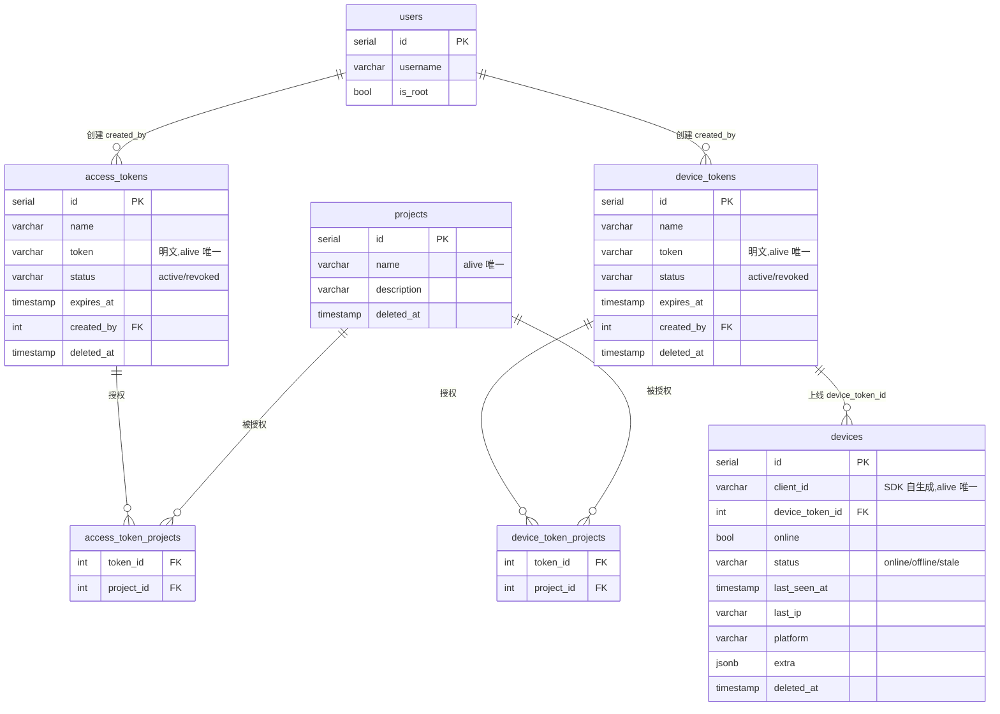
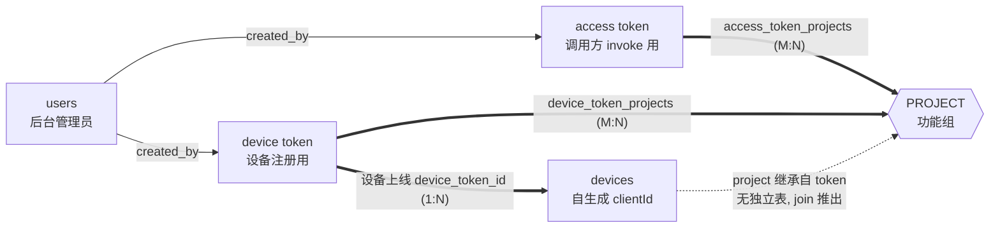

# 设备接入模型重构(device-model redesign)设计文档

> 状态：✅ 已实施，作为历史设计归档；当前能力与命令以 `docs/R2RPC-核心功能统计.md` 为准。

> **性质:** epic 级设计北极星。定架构与决策,不含实现细节(SQL/端点级细节在各子项 spec 里)。
> **状态:** 设计已与用户对齐(2026-07-09 更新:device token 天然绑定 project、砍 client_groups)。待用户终审后逐子项 spec → plan → 实现。
> **生成:** 2026-07-09。

## 1. 背景 & 动机

当前设备接入是"管理员预建账户"模型:`POST /clients {clientId, secret, groups}` 预建 `clients` 账户 + `client_groups` 组成员 → 设备 `POST /api/client/login {clientId, secret}` 换 JWT → 连 WS。

问题:SDK 是**通用 build,不可能为每台设备编译**,所以设备不能靠预建的 `clientId+secret`。设备应当**自带稳定身份、自注册上来**。同时需要把"设备注册凭证"与"调用方 invoke 凭证"分开,并让"功能组"这个概念名正言顺。

## 2. 决策记录(已锁定)

| # | 决策 | 选择 | 理由 |
|---|------|------|------|
| 架构 | 三个独立概念 | PROJECT / device token / access token | 见 §3 |
| 一 | 旧 client-login(clientId+secret 预建账户) | **删除,全量替换** | 设备全走 device-token 自注册,最干净 |
| 二 | `groups` 改名 | **连库带码全改 `groups→projects`** | 概念正名,彻底 |
| 三 | 设备能力如何定 | **device token 建时勾 project,设备不自报,上线即加入 token 的全部 project** | token 与 project 天然绑定,协议最简,并因此砍掉 `client_groups` 表 |

## 3. 目标架构:三个独立概念

```
① PROJECT(功能组)  ← 现 groups 改名。设备与两类 token 都挂到它上
      ├── access token ──(access_token_projects)── 调用方 invoke 授权:能调哪些 PROJECT
      └── device token ──(device_token_projects)── 设备注册授权:设备上来即进这些 PROJECT

② device token(新)   专给【设备注册上线】。明文进 SDK 配置。CRUD + 显示"上了多少设备"。建时勾 PROJECT。
③ access token(现有,不动)  专给【调用方 invoke】。勾 PROJECT。
```

- **设备(worker)** 用 **device token** 自注册上线,**继承该 token 的 project**(不自报能力)。
- **调用方(caller)** 用 **access token** 发起 invoke。
- 两类凭证**分表、分权、分用途**,互不越权。

## 4. 目标数据模型

| 表 | 变化 | 说明 |
|---|---|---|
| `groups` → **`projects`** | 改名(库+码+迁移) | 功能组;实体表,保留 `description` + `deleted_at` |
| `access_token_groups` → **`access_token_projects`** | 改名 | 调用方 token ↔ project(M2M) |
| `access_tokens` | 不动 | invoke 调用方凭证 |
| **`device_tokens`** | 🆕 | 设备注册凭证。列见下 |
| **`device_token_projects`** | 🆕 | device token ↔ project(M2M)。**设备的 project 归属由它决定** |
| `clients` | **删** | 预建账户模型作废 |
| `client_groups` | **删** | 设备 project 归属改为「继承 device token」,无需独立设备↔project 表 |
| `devices` | 扩列 | **唯一设备记录**(见下) |

**关键连带结论**(由决策一/二/三逻辑导出):
- `clients` 删 → `devices` 成为**唯一设备记录**;
- **`client_groups` 直接删除**:设备的 project 不再单独存表,而是**继承它上线所用 device token 的 project**(device_token 建时勾定,天然绑定)。`devices.device_token_id → device_tokens → device_token_projects` 即可推出设备在哪些 project;
- 运行期 presence 在设备上线时,按该 token 的 projects 灌入 `project:clients:{pid}`(供 `pickOnline`)。

**`device_tokens` 列**(镜像 `access_tokens` 结构,复用模式):
`id, name, token(明文可回看), status(active/revoked), expires_at?, description, created_by, created_at, deleted_at`;partial unique on `token where deleted_at is null`。

**`devices` 目标列**:
`id, client_id(SDK 自生成,唯一 alive), device_token_id(→ device_tokens,记由哪个 token 上来), online(bool), status(online/offline/stale,口径见子项4), last_seen_at, last_ip, platform, extra(jsonb/text), description, deleted_at`。

**"该 token 上了多少设备"** = `count(devices where device_token_id = ? and online)`(或 total,子项2 定口径)。

**迁移策略:** 后端无需保留的生产数据(尚未重构上线)→ **破坏式迁移**(drop `clients`/`client_groups`、rename、建新表、alter `devices`),demo 数据由 seed 重建。

### 4.1 关系图(ER)

> 目标模型(重构后)。`◇──<` 读作"一对多";两条一对多指向同一张关联表 = 多对多(M:N)。



> ⚠️ **`devices` 与 `projects` 没有直接外键**:设备的 project **继承自它的 `device_token`**,用 `devices.device_token_id → device_token_projects` join 推出(所以砍掉了 `client_groups`)。这条"派生关系"见下面概念图的虚线。

### 4.2 概念关系图(PROJECT 为枢纽)



**运行期(不在 ER 里):** 调用方持 access token 调 `invoke /:project/:action` → 校验 token 有该 project → `pickOnline(project)` 从 `project:clients:{pid}`(设备上线时按其 device token 的 project 灌入的 Redis 集合)里轮询选一台在线设备。

## 5. 设备自注册流程

```
前置:管理员建 device token,勾若干 PROJECT。token 明文写进 SDK【配置】(非编译进代码)。

设备(通用 SDK)上线:
  1. 自生成 clientId(读设备稳定值,如 android_id 派生)
  2. 连 WS /api/client/ws?token=<device-token>&clientId=<自生成>[&platform=<可选>]
  3. 服务端校验 device token(存在/未过期/active)→ 取该 token 勾定的 PROJECT 集 T;失败 close(4001)
  4. 连上即处理(device token 已天然绑定 project,无需能力上报):
       · upsert devices(client_id, device_token_id, platform, last_ip=从socket, online=true, last_seen)
       · presence.online(clientId, T)        // 灌 project:clients:{pid}
       · 回 welcome {clientId, projects: T}
  心跳:{heartbeat} → presence.refresh + last_seen 节流写库 → heartbeatAck
  回结果:{result,...} → registry.handleResult(不变)
  下线:presence.offline + devices.online=false(遵循缓存准则,见 §7)
```

- `last_ip` 从连接 socket 取;`platform` 可选 query 参数;`extra` 暂缺省(子项4 补齐)。
- 协议贴近现状:连上即 welcome,**无 register 首帧、无能力上报**。

## 6. device token 管理

- CRUD API `/device-tokens`(生成返回明文/列表含在线设备数/`PATCH :id/projects` 二次编辑作用域/撤销/软删),权限 `manage/device-token`(admin isRoot 直通)。
- 与 `/access-tokens` 对称;复用 access-token 模块模式(明文回看、redis 缓存、软删+缓存失效)。
- 作用域更新后删除鉴权缓存，并通过 Redis pub/sub 通知所有 API 实例关闭该令牌的现有连接；
  设备重连后按新 project 集重新登记 presence，避免删除的旧作用域继续可用。

## 7. 冷热路径 & 缓存失效(全局准则,本重构遵循)

- **热路径 presence**(invoke 派发读的 Redis 集合 `project:clients:{pid}`):由 WS 生命周期(上线/心跳/断开)**主动写**。
- **权威态被动变更**(stale 扫描置离线、device token 撤销/软删、admin 操作):**删对应 Redis 键**,不 update-in-place;设备下次心跳/请求进来懒回填。
- device token 校验走 cache-aside(fail-open),撤销/删同步删缓存——照 `AccessTokenGuard` 既有模式。
- 详见记忆准则:冷热分离 + 更新即删 Redis + 懒回填,减少脏数据。

## 8. 拆分 & 顺序(epic → 子项,每块独立 spec/plan/PR)

1. **rename `groups→projects`**:`groups→projects`、`access_token_groups→access_token_projects`、全码引用、迁移。纯机械、无行为变化。**先做,后续全用新名。**(`client_groups` 不参与本次 rename——它将在子项3 直接删除。)
2. **device token**:`device_tokens` + `device_token_projects` + CRUD API + `manage/device-token` 权限 + 在线设备数。独立、无依赖。
3. **设备自注册 + 删 client-login**:WS 网关改 device-token 鉴权 + 自生成 id → upsert `devices`(继承 token 的 project)+ presence;**删 `clients`/`client_groups`/`POST /clients`/`/api/client/login`/ClientService/Controller**;改 RBAC(去 `create/client`+`read/client`)、seed、smoke。**最大一块。**
4. **设备持久态**(原待办 #2 剩余):stale 扫描 worker + 设备列表/详情 API(`read/device`)+ platform/ip/extra 落齐 + `status` 口径定稿。

> 无生产系统需保活(尚未重构上线)→ 子项3 可直接删 client-login,不必为"过渡期保活"额外排序。

## 9. Out of scope
- 前端管理后台(独立)。
- 指标聚合体系(待办 #3)、maxInFlight(#4)、WS 健壮性(#5/#6)、账户/分组开关(#7/#8)——不在本 epic。

## 10. 测试策略
- 每子项独立冒烟。子项3 需**重写 `test/smoke.e2e.js`**:去掉 `POST /clients`+client-login,改 device-token 建号 + 自注册上线 + invoke 闭环。
- 有 API 的走 API 验证(遵循 api-vs-pg-boundary 准则);仅 worker/无 API 面(stale 扫描)才直连 PG 冒烟。
