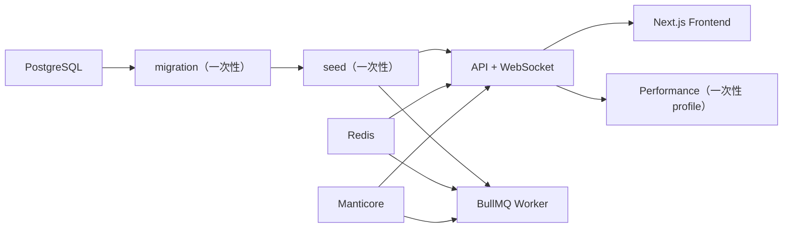

# 统一配置与 Docker Compose 设计

> 日期：2026-07-24  
> 状态：已批准实施

## 1. 目标

1. 后端 API、Worker、迁移、种子和管理前端读取同一份 YAML 契约。
2. 删除 `CORS_ORIGIN`、`ADMIN_USER`、`ADMIN_PASSWORD`、
   `NEXT_PUBLIC_API_URL`、`NEXT_PUBLIC_API_PORT`、`NEXT_ALLOWED_DEV_ORIGINS`
   和 `FRONTEND_CONFIG_FILE` 等分散配置入口。
3. 只保留可选的 `CONFIG_FILE` 作为配置文件位置选择器；它不能承载业务配置值。
4. 根目录 `config.example.yaml` 作为宿主机开发模板；Compose 使用相同 schema 的
   `deploy/config.example.yaml`，区别只在基础设施主机名。
5. Compose 覆盖 PostgreSQL、Redis、Manticore、迁移、种子、API、Worker 和前端完整拓扑，
   迁移与种子保持一次性任务，不塞进 API 启动流程。
6. 可选 performance profile 复用统一配置和后端镜像；完整 Compose 的声明资源上限不得超过
   4 核、4 GiB。

## 2. 配置契约

统一 YAML 包含：

- `app`：API 端口、全局前缀、设备可见 WebSocket 地址和 CORS Origin。
- `frontend`：浏览器访问 API 的绝对地址或同主机端口、开发资源允许来源。
- `db`、`redis`、`manticore`：基础设施连接。
- `jwt`：签名、有效期和授权缓存 TTL。
- `bootstrap.admin`：幂等种子管理员账号。
- `performance`：目标地址、功能组、虚拟设备数、预热/测量时长、目标速率、质量阈值和结果路径。
- `retention`：请求日志和聚合保留策略。

`frontend.apiUrl` 为 `null` 时，浏览器使用“当前页面协议与主机 +
`frontend.apiPort`”；不得向浏览器注入数据库、Redis、JWT 或管理员配置。

## 3. 文件发现与校验

1. 若提供 `CONFIG_FILE`，前后端都读取该绝对或相对路径。
2. 后端未提供选择器时，从当前工作目录向父目录查找最近的 `config.yaml`。
   前端本地脚本显式选择根目录文件，容器则默认读取 `/app/config.yaml`。
3. 后端使用完整 zod schema，缺文件或任一字段非法时启动失败。
4. 前端只解析 `frontend` 白名单并做 zod 校验，服务端注入浏览器时不泄露其他配置段。
5. 配置在进程内只读取一次；修改后通过重启对应容器或进程生效。

真实 `config.yaml` 继续由 `.gitignore` 排除。仓库只提交不含生产秘密的 example。

## 4. Compose 拓扑

- 基础设施服务有持久卷和健康检查。
- `migration` 等 PostgreSQL 健康后执行幂等 Drizzle 迁移。
- `seed` 仅在迁移成功后执行幂等管理员、权限和演示功能组种子。
- API 与 Worker 只在两个一次性任务成功后启动。
- 前端等待 API 健康后启动。
- API、Worker、迁移、种子和前端只读挂载同一份 Compose `config.yaml`。
- 不使用固定 `container_name`，服务统一由 Compose project 管理。
- 根编排固定使用 project 名 `r2rpc`，容器网络和命名卷不依赖本地目录名称。
- 应用容器以非 root 用户运行；配置只读挂载，数据写入命名卷。
- performance 等 API 健康、Worker 启动后执行，挂载虚拟设备并只访问公开 HTTP/WebSocket，
  报告写入宿主机目录。
- 所有服务声明 CPU、内存和 PID 限制；把常驻、一次性和 profile 服务全部相加仍不超过
  4.00 CPU 与 4 GiB。

官方 PostgreSQL 镜像的首次建库参数属于容器引导协议，Compose 固定为开发模板中的
`r2rpc`。生产部署若修改数据库账号，必须同时修改 Compose 的 PostgreSQL 引导参数和
统一配置；使用外部托管 PostgreSQL 时删除本地 `postgres` 服务即可。

## 5. 兼容与边界

- 公开 HTTP、WebSocket、数据库表和前端页面协议不变化。
- E2E 的 `BASE_URL`、`E2E_FRONTEND_PORT` 等只属于测试目标选择，不是应用运行配置。
- `CONFIG_FILE` 是唯一允许保留的应用配置环境变量，便于 CI、测试和多环境选择文件。
- 历史 `backend/config.yaml`、`deploy/frontend.yaml` 和前端 `.env.local` 不再使用。

## 6. 验收

1. 后端配置 loader 单元测试覆盖向上查找、显式文件、默认值和非法配置。
2. 后端 build、lint、Jest 与完整 HTTP/WebSocket 黑盒通过。
3. 前端 lint、build 与 Playwright 黑盒通过。
4. `docker compose config` 通过，API/Worker/frontend 镜像构建成功。
5. 静态搜索确认应用源码不再读取已删除的分散环境变量。
6. 解析 Compose 渲染结果确认 CPU 上限合计 4.00 核、内存上限不超过 4096 MiB，并通过
   Docker `HostConfig` 抽查实际限制。
7. performance 容器在受限隔离全栈中通过错误率、P95 延迟和吞吐阈值并生成 JSON 报告。
