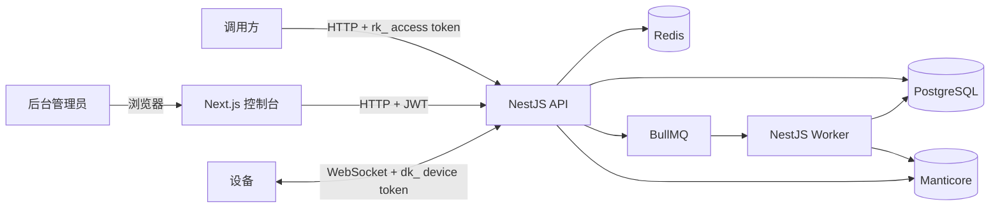

# RER0RPC 项目总览

> 更新日期：2026-07-24。本文描述当前仓库中的 NestJS 重写版；旧 Go/MySQL 系统文档已移至 `docs/archive/`。

## 1. 项目定位

RER0RPC 是设备侧 RPC 中继平台。调用方使用独立 access token，按 `project` 或指定 `clientId` 发起 HTTP 请求；在线设备通过 WebSocket 接收任务、执行并回传结果。

当前仓库包含 NestJS 后端、Next.js 管理前端、基础设施编排和文档。设备 SDK 与手机端
Runtime 仍不在本仓库范围。

## 2. 当前状态

| 维度 | 状态 |
|---|---|
| 后端既定 backlog #1–#15 | ✅ 全部完成 |
| HTTP API | ✅ 39 个路径模板 |
| WebSocket 设备协议 | ✅ 鉴权、心跳、RPC、AppAudit Step、限流及异常帧防护 |
| API / Worker 双进程 | ✅ |
| 数据库迁移 | ✅ 9 个 Drizzle 迁移、15 张表 |
| OpenAPI | ✅ `docs/openapi.yaml`，可用 `pnpm openapi:gen` 重导出 |
| 黑盒完整性冒烟 | ✅ 172 项，只走 HTTP/WS |
| 后端单元测试 | ✅ Jest 9 suites / 31 tests |
| 代码可读性门禁 | ✅ 禁止含糊缩写；复杂度 ≤ 10、嵌套 ≤ 3、语句 ≤ 40 |
| 管理前端 | ✅ Next.js 16 + shadcn，覆盖全部后台管理公开面 |
| 前端浏览器 E2E | ✅ Playwright 12 项，只走 UI + HTTP API，边界守卫禁止直连持久层 |
| 设备 SDK | 不在本仓库范围 |
| 生产镜像、CI、健康检查 | 前端镜像 ✅；API/Worker 镜像、CI、健康检查待补 |

唯一功能进度台账是 `docs/后端进度.md`。

## 3. 架构

### API 进程

- 入口：`backend/src/main.ts`
- HTTP、Swagger 与 `/api/client/ws`
- 做鉴权、校验、RPC 派发及热路径入队
- 默认端口：`3000`

### Worker 进程

- 入口：`backend/src/worker.ts`
- 消费请求日志与死信队列
- 写请求日志脊柱、Manticore payload/AppAudit、日聚合指标
- 执行 retention、stale、metrics cleanup 和启动对账

### 管理前端

- 目录：`frontend/`
- Next.js 16 App Router、React 19、Tailwind CSS 4、shadcn 和 TanStack Query
- 默认端口 `3001`，通过公开 HTTP API 访问后端，不读取数据库或缓存
- 页面覆盖运行概览、功能组、设备、两类令牌、请求日志/AppAudit、后台账号、权限组和系统日志
- 手动 RPC 调试页选择功能组、历史 Action、在线设备、超时和 Payload，并展示真实调用请求、
  响应、状态和耗时；调用等待期间操作按钮保持尺寸、位置和不透明度稳定
- 全部实体表支持字段筛选与分页（默认 10 条/页、最大 100 条/页）；分页器作为表格页脚，支持数字页码与指定页跳转
- 运行概览使用带节点和面积渐变的近 7 天折线趋势图
- 请求日志详情使用最大 96rem/96vw 的右侧抽屉，AppAudit Step 默认收起
- 令牌与 JSON 复制复用公共 `CopyButton`；Clipboard API 不可用或被拒绝时自动回退
- 运行时可通过 `/app/frontend.yaml` 或 `NEXT_PUBLIC_API_URL` 切换后端地址

## 4. 核心模型

| 模型 | 说明 |
|---|---|
| `project` | 功能组，旧系统 `group` 的新名称 |
| `device token` | `dk_` 前缀；设备上线凭证，可二次编辑 project，更新时断开旧作用域连接 |
| `access token` | `rk_` 前缀；调用方 invoke 凭证，可二次编辑 project 并立即清除鉴权缓存 |
| `device` | 设备持久态；`clientId` 由设备生成并在 WS query 中声明 |
| `user / permission group / permission` | 后台 JWT、CASL 权限并集、root-only RBAC 写入与管理员账号隔离 |

后台 JWT 每次鉴权通过公共 Redis cache-aside 读取用户身份和权限快照，默认 TTL 为 60 秒。
Redis 未命中、缓存数据不符合契约或 Redis 异常时回源 PostgreSQL 并回写；权限关系、用户分组、
账号启停和软删除写入成功后立即删除所有受影响用户的缓存。
| `request_logs` | PostgreSQL 取证脊柱 |
| `request_logs` Manticore 文档 | 请求/响应 payload 与设备 AppAudit Step 原文 |
| `system_logs` | 后台“谁在何时做了什么”的不可变操作审计 |
| `*_daily_metrics` | 日聚合指标 |

## 5. 两条主链路

### 设备上线

1. 管理员创建绑定 project 的 `dk_` device token。
2. 设备连接 `/api/client/ws?token=<dk_>&clientId=<id>`。
3. API 校验 token，登记 Redis presence，并 upsert PostgreSQL `devices`。
4. 服务端返回 `welcome`，之后每 5 秒主动 ping。

管理员二次编辑 device token 的 project 作用域后，服务端清除 WS 鉴权缓存，并通过 Redis
集群事件关闭该 token 的现有连接（close `4002`）；设备重连后收到新的 project 作用域。

### RPC 调用

1. 调用方请求 `POST /rpc/invoke/:project/:action`，携带 `rk_` access token；或具有
   `invoke/manual-rpc` 的后台账号通过 `POST /rpc/debug/invoke/:project/:action` 手动调试。
2. API 校验 token project 作用域与 project enabled；管理员更新 access token 作用域后会立即
   清除鉴权缓存，下一次调用即使用新作用域。
3. Redis 轮询选择在线且未达到 `maxInFlight` 的设备。
4. 通过本地 socket 或 Redis pub/sub 跨实例派发 job。
5. 设备回传 result，可附带 AppAudit V1；API 校验来源 clientId、去重和审计结构后返回调用结果。
6. 请求日志入 BullMQ，由 Worker 写 PG 脊柱、Manticore payload/AppAudit 和日聚合；公开
   调用记录 `accessTokenId`，手动调用记录 `requesterUserId`。

手动调试先通过 `GET /rpc/debug/options` 读取功能组、历史 Action 和在线设备。调用完成后另写
系统操作审计，只记录功能组、Action、设备和超时，不保存 Payload。

## 6. 数据与状态

- PostgreSQL：用户、RBAC、project、token、设备持久态、系统操作审计、请求脊柱和日指标。
- Redis：presence、在线集合、session/waiter、结果去重、轮询游标、在途槽、BullMQ。
- Manticore：完整请求/响应 payload 与设备执行 Step。
- 浏览器：只在 `localStorage` 保存后台 JWT；业务数据由 TanStack Query 管理，不作为权威状态。
- 非日志实体统一使用 `description`、`deleted_at` 和 partial unique。
- API/Worker 启动时不自动迁移；迁移必须单独执行。

## 7. 鉴权边界

| 调用面 | 凭证 |
|---|---|
| 后台管理 API（含 `/rpc/debug/*`） | 用户 JWT + RBAC |
| 公开 RPC invoke/clientQueue | `rk_` access token |
| 设备 WebSocket | `dk_` device token |

三类凭证不可互换。

`isRoot` 种子管理员账号只能由本人修改。资料、密码、enabled、软删除和用户角色绑定/解绑均使用
同一个服务层策略；`users.role` 不参与授权或管理员保护。

`roles` 是权限组。具有 `read/rbac` 的账号可读取权限组、权限目录和用户已分配组；权限组、
权限目录与用户分组的所有写操作仅种子管理员可执行，`manage/rbac` 不能绕过 `RootGuard`。
当前 19 条内置权限全部带完整说明；手动 RPC 调试使用独立 `invoke/manual-rpc`，operator
默认只有 8 条 `read/*` 权限，不自动获得调用能力。

系统日志记录登录成功/失败、JWT 控制面读取、Guard/路由阶段拒绝和后台管理 mutation；
mutation 通过 `@SystemAudit` 保留准确业务语义。日志只允许 `read/system-log` 查询，
不提供修改或删除入口，也不会保存密码/token 明文。RPC invoke、设备 WS 与 AppAudit
继续使用独立数据面日志。

## 8. 测试口径

- `pnpm test`：纯单元测试。
- `pnpm test:e2e` / `pnpm smoke`：完整黑盒冒烟，只通过运行中的 HTTP/WS 接口。
- `test/assert-blackbox-e2e.js`：阻止 E2E 导入数据库、Redis或应用内部服务。
- `pnpm test:integration:*`：内部算法集成检查，明确不是 E2E。

当前 172 项黑盒套件覆盖所有 HTTP controller 方法、登录/读取/拒绝/写入系统审计与敏感字段隔离、权限组编辑/
嵌套权限/用户分组/root 写隔离、用户资料/改密、管理员写隔离和两类令牌作用域二次编辑，以及 WS 鉴权、welcome、
heartbeat、主动 ping、读超时、4 MiB
帧限制、拒绝分片、Device Token 旧作用域连接断开重连、RPC result 身份匹配/去重、设备 AppAudit 成功/失败 Step 与非法审计隔离、
maxInFlight、手动 RPC 权限/上下文/真实调用/审计/发起人溯源和在线/离线持久态。

前端 Playwright 12 项冒烟先通过登录页获取真实 JWT，再逐页调用公开 HTTP API，并验证手动
RPC 调试、筛选分页、令牌作用域编辑、复制回退、日志抽屉、导航预取和登录保护。静态边界守卫拒绝 E2E
导入后端内部模块、PG/Drizzle/Redis 客户端或 SQL；因此前端和后端 E2E 口径一致。

设备接入审计协议见 `docs/device-app-audit.md`。

## 9. 已知非阻塞事项

- 生产交付仍缺 CI、API/Worker 镜像编排、统一反向代理和健康检查；管理前端已有生产镜像。

## 10. 文档入口

- `README.md`：仓库入口与快速开始
- `backend/README.md`：后端开发、配置和命令
- `frontend/README.md`：前端页面、配置、开发、构建和浏览器黑盒
- `docs/RER0RPC-核心功能统计.md`：当前能力矩阵
- `docs/后端进度.md`：唯一进度真源
- `docs/design-conventions.md`：工程规范
- `docs/superpowers/specs/2026-07-24-administrator-account-isolation-design.md`：管理员账号隔离与改密设计
- `docs/superpowers/specs/2026-07-24-permission-groups-design.md`：权限组设计
- `docs/superpowers/specs/2026-07-24-system-audit-logs-design.md`：系统操作审计日志设计
- `docs/superpowers/specs/2026-07-24-manual-rpc-debugger-design.md`：手动 RPC 调试设计
- `docs/openapi.yaml`：HTTP OpenAPI
- `deploy/README.md`：本地基础设施
- `docs/archive/`：旧 Go 系统及开工阶段历史文档
